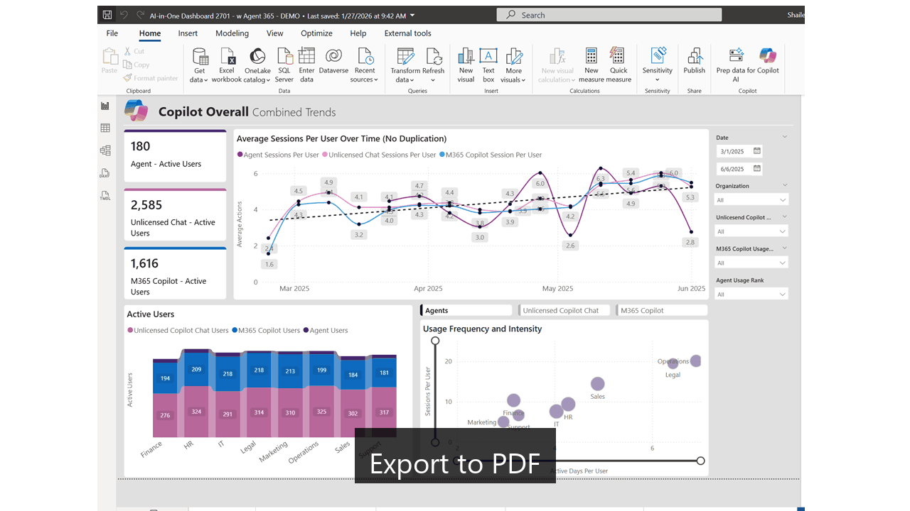

# “Dashboards → Decks”

## From raw numbers to executive-ready, insight-driven presentations — in about 3 minutes.

Building slides is time-consuming. Extracting insights from dashboards is hard. Packaging everything for executives takes real effort. This tool handles all three automatically.

Transform Power BI dashboards (PDF or PPTX) into professional presentations with analyst-grade insights. No design skills required.

## What You Get

**Input:** Raw dashboard export in PDF or PPTX 
**Output:** Professional 16:9 presentation with:
- Clean, formatted slides
- Analyst-grade insights with specific numbers
- Actionable recommendations
- Executive-friendly language

### Example Transformation

**Raw numbers on a report:**
> "1,275 active Copilot users", "134 Agent users"

**Analyst-Grade Insight:**
> "134 Agent users from 1,275 total (11%) - significant opportunity to expand automation adoption. HR Generalists (140 actions/user) are 3-4x above average - great candidates to champion agent adoption"

---

## See It in Action



From Power BI dashboard to executive presentation in 3 minutes.

---

## How to Use (3 Steps)

### Step 1: Export your Power BI dashboard

**PDF** (from Power BI Desktop): File → Export → Export to PDF
**PPTX** (from Power BI Online): File → Export → PowerPoint (Static Images)

Both formats work identically.

### Step 2: Run in terminal

Clone the repo:
```bash
git clone https://github.com/shailendrahegde/pbi-to-exec-deck.git
cd pbi-to-exec-deck
```

**Open in Claude Code (important!):**
```bash
claude
```

Convert your dashboard:
```
convert to an executive deck "C:\Users\you\Downloads\dashboard.pdf"
```

### Step 3: Done

Open `dashboard_executive.pptx` - your professional presentation is ready in ~3 minutes.

**Claude automatically:**
- Detects and installs Python/dependencies (if needed)
- Extracts dashboard images
- Generates analyst-grade insights
- Builds your executive deck

**Prerequisite:** [Claude Code CLI](https://docs.anthropic.com/claude-code) - everything else is auto-installed.

---

## What Makes This Different

✅ **Analyst-grade insights** - Not just data restatements
✅ **No API key needed** - Uses your Claude Code session
✅ **Automatic setup** - Claude installs dependencies for you
✅ **16:9 widescreen** - Modern presentation format
✅ **Specific numbers** - Every insight backed by data
✅ **Friendly tone** - Opportunities, not criticisms
✅ **Fast** - Complete in under 3 minutes

---


## How It Works

**Step 1 (Deterministic):** Python extracts dashboard images and structure
**Step 2 (Intelligent):** Claude analyzes dashboards as senior analyst advisor
**Step 3 (Deterministic):** Python renders professional slides with insights

**Key differentiator:** Technical tasks are automated, strategic analysis uses AI, predictable output, traceable insights.

---

## Key Files

- `convert_dashboard_claude.py` - Main converter
- `CLAUDE.md` - Detailed workflow for Claude
- `Claude PowerPoint Constitution.md` - Quality standards
- `Example-Storyboard-Analytics.pptx` - Visual template reference


## License

MIT - Use freely for your organization

---

## Ready to Try?

**Run the 3-step process above** on your Power BI dashboard.

**You'll have a professional executive deck in under 3 minutes.**

---

**Found this useful?** ⭐ [Star this repo](https://github.com/shailendrahegde/pbi-to-exec-deck) to help others discover it!

That's it! 🚀
