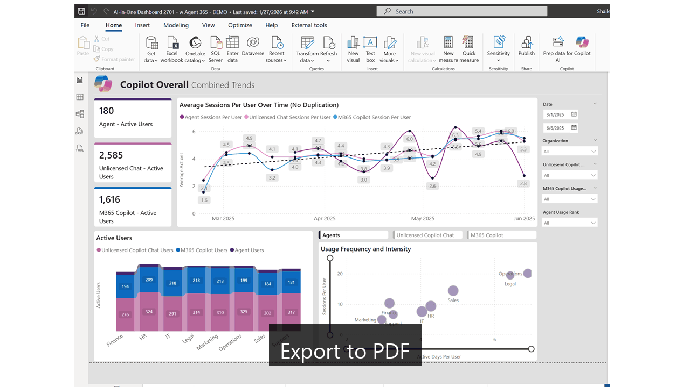

# Dashboards → Decks

### From raw Power BI data to executive-ready presentations — in minutes.

Turn Power BI dashboards into polished, insight-driven presentations automatically. No design skills, no manual slide-building, no copy-pasting numbers.

Works with **Claude Code** or **GitHub Copilot Chat** — choose the assistant that fits your setup.

---

## Quick Start

```bash
git clone https://github.com/shailendrahegde/pbi-to-exec-deck.git
cd pbi-to-exec-deck
```

Then pick your assistant:

| | Claude Code | GitHub Copilot Chat |
|---|---|---|
| **Setup** | [Install Claude Code CLI](https://docs.anthropic.com/en/docs/claude-code/overview) | Open repo in VS Code with Copilot |
| **Run** | `claude` → _"convert to an executive deck ‹path›"_ | Ask Copilot Chat: _"Convert ‹path› to an executive deck"_ |
| **API key?** | Uses Claude session | No key needed |
| **Deps** | `requirements.txt` | `requirements-copilot.txt` |

Dependencies are auto-installed on first run. You can also install manually:

```bash
pip install -r requirements.txt          # Claude
pip install -r requirements-copilot.txt  # Copilot
```

Optional PowerShell alias (run `convert-to-exec-deck` from anywhere):

```powershell
./install-alias.ps1
```

---

## How It Works

Both assistants follow the same three-step pipeline:

### 1. Extract
Parse the source file into per-slide PNG images and metadata.

### 2. Analyze
The AI reads each dashboard image, extracts numbers, identifies trends, and generates analyst-grade insights following the [Insight Formula](#insight-formula).

### 3. Build
Assemble a polished 16:9 PPTX with embedded PBI screenshots (default) or vector charts, insight headlines, executive summary, and recommendations.

---

## Claude Workflow

Single-command run (installs deps + converts + validates):

```bash
./convert-to-exec-deck.cmd "C:\path\to\dashboard.pdf"
```

Or from inside Claude Code:

```
convert to an executive deck "C:\path\to\dashboard.pdf"
```



Output is saved as `*_executive.pptx` (~3 minutes).

---

## GitHub Copilot Workflow

Open the repo in VS Code and ask Copilot Chat (agent mode):

> Convert `C:\path\to\dashboard.pptx` to an executive deck

Copilot reads [COPILOT.md](COPILOT.md) (auto-discovered via [.github/copilot-instructions.md](.github/copilot-instructions.md)) and runs the three steps automatically:

```bash
# Step 1 — Extract (text layer + EasyOCR fallback for PPTX dashboard images)
python convert_dashboard.py "<path>" --prepare --assistant copilot

# Step 2 — Copilot reads images + OCR-enriched text, generates insights, writes JSON

# Step 3 — Build (default: PBI screenshots; add --vector-charts for matplotlib SVGs)
python convert_dashboard.py --build --output "<output>.pptx"
```

### EasyOCR Fallback

Power BI PPTX exports embed dashboards as full-page PNG screenshots — no extractable text. The pipeline automatically:

1. Tries embedded text first (markitdown / python-pptx)
2. Detects boilerplate output ("No alt text provided", chart type names)
3. Falls back to **EasyOCR** to extract real numbers, KPIs, and labels from the images

This ensures insights reference actual data (e.g. "150 Active Users, 39.7% Power Users") instead of describing chart types.

See [COPILOT.md](COPILOT.md) for the full JSON schema, insight formula, chart specs, and quality guidelines.

---

## Supported Inputs

| Input | Format | Data Source |
|---|---|---|
| **PDF export** | `.pdf` | AI reads page images |
| **PPTX export** | `.pptx` | AI reads slide images + OCR text extraction |
| **PBIP project** | `.pbip` | Live DAX queries via MCP (exact values) |
| **PBIX file** | `.pbix` | Live DAX queries via MCP (exact values) |

**How to export from Power BI:**
- **PDF** — Power BI Desktop: `File → Export → Export to PDF`
- **PPTX** — Power BI Service: `File → Export → PowerPoint`

---

## Deep Analysis Mode (PBIP / PBIX)

For `.pbip` or `.pbix` files, the tool connects to the live Power BI Desktop model via MCP and queries exact values using DAX — no visual estimation needed.

> **Prefer `.pbip` over `.pbix` when you have the choice.**
> PBIP stores the semantic model as plain-text TMDL files, so the assistant can read every measure's DAX expression and understand exactly how each KPI is calculated.

### Setup (one-time)

```bash
python setup_pbi_mcp.py          # Download & register MCP server
python setup_pbi_mcp.py --check  # Verify installation
```

This downloads the official [microsoft/powerbi-modeling-mcp](https://github.com/microsoft/powerbi-modeling-mcp) server and registers it in `.mcp.json`.

> The MCP server runs locally and communicates only with Power BI Desktop on your machine — no data leaves your environment.

### Run

1. Open your report in Power BI Desktop
2. Restart your assistant session (Claude Code: `/exit` → `claude`)
3. Run the conversion:

```
convert to an executive deck "C:\path\to\report.pbip"
```

**Without MCP installed:** The tool falls back to image-only analysis automatically.

---

## What You Get

- **16:9 widescreen** slides with dark professional theme
- **PBI page screenshots** embedded by default for pixel-perfect dashboard visuals
- **Vector charts** (opt-in via `--vector-charts`) — bar, column, line, donut, KPI cards, tables, treemap, scatter, funnel, gauge
- **Insight-driven headlines** that answer "so what?" for each dashboard page
- **Executive summary** — 5 synthesized findings across all pages
- **Action recommendations** — specific, data-grounded next steps
- **Constitution validation** — automated quality checks on the output

---

## Insight Formula

Every insight follows this format:

**Headline:** `[Clear Takeaway Message]`

**Insight:** `"[Bold punchy line, 6-8 words] || [Supporting evidence with specific data]"`

**Example:**

Raw dashboard numbers:
> "1,275 active Copilot users", "134 Agent users"

Turned into analyst-grade insight:
> "134 Agent users from 1,275 total (11%) — significant opportunity to expand automation adoption. HR Generalists at 140 actions/user are 3–4x above average: strong candidates to champion agent adoption org-wide."

---

## Key Files

| File | Purpose |
|---|---|
| `convert_dashboard.py` | Main entry point — extract, analyze, build |
| `run_pipeline.py` | Single-command wrapper (deps + convert + validate) |
| `convert-to-exec-deck.cmd` | Windows batch launcher for `run_pipeline.py` |
| `check_setup.py` | Dependency validation (`--profile claude\|copilot`) |
| `setup_pbi_mcp.py` | One-time MCP server setup for PBIP/PBIX mode |
| **Extraction** | |
| `lib/extraction/extractor.py` | Markitdown-based text + metric extraction |
| `lib/extraction/text_layer_extractor.py` | PPTX/PDF text-layer enrichment |
| `lib/extraction/ocr_extractor.py` | EasyOCR fallback for dashboard PNGs |
| `lib/extraction/pdf_extractor.py` | PDF page rendering (PyMuPDF / pypdfium2) |
| `lib/extraction/pbip_extractor.py` | PBIP folder parsing and DAX query generation |
| `lib/extraction/pbix_extractor.py` | PBIX ZIP extraction and screenshot handling |
| **Rendering** | |
| `lib/rendering/builder.py` | Slide layout and PPTX assembly |
| `lib/rendering/chart_builder_mpl.py` | SVG chart rendering (matplotlib) |
| `lib/rendering/validator.py` | Constitution compliance checker |
| **Instructions** | |
| `CLAUDE.md` | Full instructions for Claude's analysis workflow |
| `COPILOT.md` | Full instructions for Copilot Chat workflow |
| `.github/copilot-instructions.md` | VS Code auto-discovery for Copilot |
| `Claude PowerPoint Constitution.md` | Quality standards and governance |

---

## License

MIT — use freely within your organization.

---

**Found this useful?** [Star the repo](https://github.com/shailendrahegde/pbi-to-exec-deck) to help others find it.
